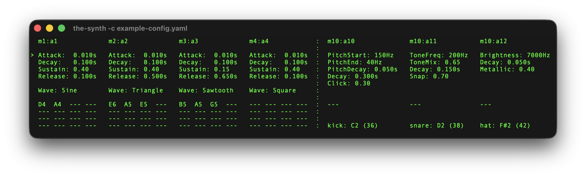

# the-synth

A minimal MIDI synthesizer for the terminal with 16-voice polyphony, multiple
waveforms, and ADSR envelope control.

## Usage

List available devices:
```sh
cargo run -- --list
```

Run the synth with your devices:
```sh
# By device index
cargo run -- --midi 0 --audio 0

# By device name (substring match)
cargo run -- --midi "beefdown" --audio "MacBook"

# With specific MIDI channel
cargo run -- --midi 0 --audio 0 --channel 5

# Omni mode (all MIDI channels, default)
cargo run -- --midi 0 --audio 0 --channel omni
```

## Interface



<br>

**Attack** (0.001s - 2.0s): Time to reach peak level when a note is pressed

**Decay** (0.001s - 2.0s): Time to fall from peak to sustain level

**Sustain** (0.0 - 1.0): Amplitude level held while note is pressed

**Release** (0.001s - 5.0s): Time to fade to silence after note is released

**Waveform**: Oscillator shape (Sine, Triangle, Sawtooth, Square)

The bottom section shows active voices - each of the 16 polyphonic voices
displays its current note (e.g., "C4", "F#3") or "---" when idle.

<br clear="left"/>

## Controls

```
j/k, ↑/↓  = Move cursor between parameters

h/l, ←/→  = Adjust the selected parameter value

?         = Toggle help

q, ctrl+c = quit
```
