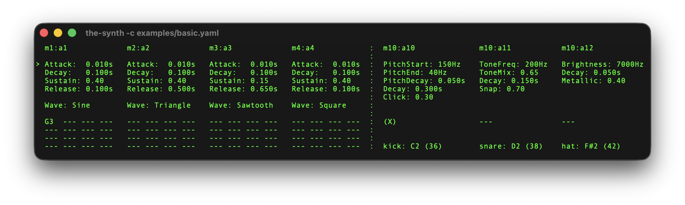
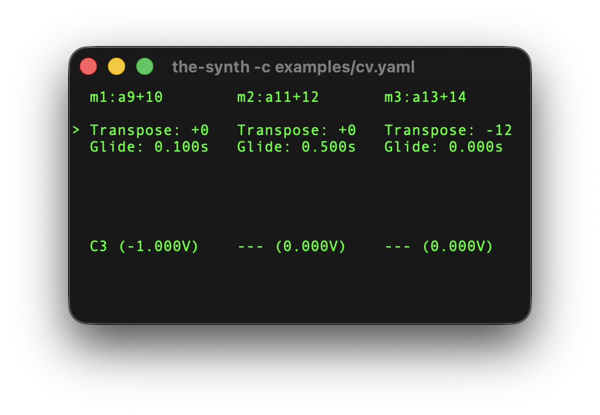

# the-synth

A multi-instance MIDI synthesizer, drum machine, and CV generator for the terminal.
Run multiple 16-voice polyphonic synthesizers, physically-modeled drum engines, and
control voltage outputs simultaneously, each with independent parameter control and
configurable MIDI/audio channel routing.

## Usage

**Installation:** There's no binary distribution so you must compile it. Use
`make build` or `make install`.

```sh
# Command help
the-synth --help

# List available MIDI and audio devices
the-synth --list

# Run with configuration file
the-synth --config example-config.yaml
```

## Configuration

Create a YAML configuration file specifying devices and synth instances:

```yaml
devices:
  midiin: "Your MIDI Device"    # Name or index from --list
  audioout: "Your Audio Device" # Name or index from --list

poly16s:
  - midich: 1           # MIDI channel 1-16 or "omni"
    audioch: 1          # Audio output channel (1-indexed)
    attack: 0.01
    decay: 0.1
    sustain: 0.4
    release: 0.1
    wave: sine          # sine, triangle, sawtooth, square

  - midich: 2
    audioch: 2
    attack: 0.001
    decay: 0.05
    sustain: 0.7
    release: 0.2
    wave: sawtooth

drums:
  - midich: 10          # MIDI channel for drum triggers
    audioch: 10         # Audio output channel
    type: kick          # kick, snare, or hat
    note: c2            # MIDI note to trigger (e.g., C2 = 36)
    pitchstart: 150.0
    pitchend: 40.0
    pitchdecay: 0.05
    kdecay: 0.3
    click: 0.3

  - midich: 10
    audioch: 11
    type: snare
    note: d2
    tonefreq: 200.0
    tonemix: 0.65
    sdecay: 0.15
    snap: 0.7

  - midich: 10
    audioch: 12
    type: hat
    note: "f#2"
    brightness: 7000.0
    hdecay: 0.05
    metallic: 0.4

cvs:
  - midich: 2           # MIDI channel for CV input
    audioch: 5          # Pitch CV on channel 5, Gate CV on channel 6
    transpose: 0        # Transpose in semitones (-24 to +24)
    glide: 0.1          # Glide time in seconds (0.0 to 2.0)

  - midich: 3
    audioch: 7          # Pitch CV on channel 7, Gate CV on channel 8
    transpose: 12       # One octave up
    glide: 0.5          # Slower glide
```

Each poly16 instance has 16-voice polyphony and independent ADSR/waveform settings.
Each drum instance triggers on a specific MIDI note with physically-modeled synthesis.
Each CV instance outputs 1V/octave pitch CV and gate CV on consecutive audio channels
for interfacing with modular synthesizers via DC-coupled audio interfaces (e.g., Expert Sleepers ES-9).

## Interface





### Poly16 Parameters

**Attack** (0.001s - 2.0s): Time to reach peak level when a note is pressed

**Decay** (0.001s - 2.0s): Time to fall from peak to sustain level

**Sustain** (0.0 - 1.0): Amplitude level held while note is pressed

**Release** (0.001s - 5.0s): Time to fade to silence after note is released

**Waveform**: Oscillator shape (Sine, Triangle, Sawtooth, Square)

The voice display shows each of the 16 polyphonic voices with its current note (e.g., "C4", "F#3") or "---" when idle.

### Drum Parameters

Each drum type has unique physically-modeled parameters:

**Kick** - Bass drum with pitch envelope and beater click
- PitchStart (100-300 Hz): Starting frequency of pitch sweep
- PitchEnd (20-100 Hz): Ending frequency of pitch sweep
- PitchDecay (0.01-0.2s): Speed of pitch envelope
- Decay (0.05-1.0s): Amplitude decay time
- Click (0.0-1.0): Amount of beater click transient

**Snare** - Snare drum with tonal/noise mix and stick attack
- ToneFreq (100-400 Hz): Frequency of tonal component
- ToneMix (0.0-1.0): Balance between tone and noise (0=noise, 1=tone)
- Decay (0.05-0.5s): Amplitude decay time
- Snap (0.0-1.0): Amount of stick attack transient and brightness

**Hat** - Hi-hat with resonant metallic character
- Brightness (5000-12000 Hz): Center frequency of resonant filter
- Decay (0.01-0.3s): Amplitude decay time
- Metallic (0.0-1.0): Resonance amount for bell-like ringing

### CV Parameters

CV (Control Voltage) instances output 1V/octave pitch CV and gate CV on consecutive
audio channels for interfacing with modular synthesizers. Requires a DC-coupled audio
interface (e.g., Expert Sleepers ES-9).

**Transpose** (-24 to +24 semitones): Pitch offset applied to incoming MIDI notes

**Glide** (0.0-2.0s): Linear portamento time between notes (legato only)

The display shows the current MIDI note name and its corresponding voltage (C4 = 0V).
Gate CV is 8V when a note is held, 0V otherwise. Glide only applies when playing legato
(holding one note while pressing another).

## Controls

```
h/l, ←/→             = Switch between instances (poly16s, drums, and CVs)

j/k, ↑/↓             = Move cursor between parameters

H/L, tab/shift+tab   = Adjust the selected parameter value

0, $                 = Jump to first/last instance

?                    = Toggle help

q, ctrl+c            = Quit
```

All parameters are editable in real-time during playback. Use Tab to navigate between
instrument instances, and the cursor will maintain its position when switching between
similar parameter sets.
