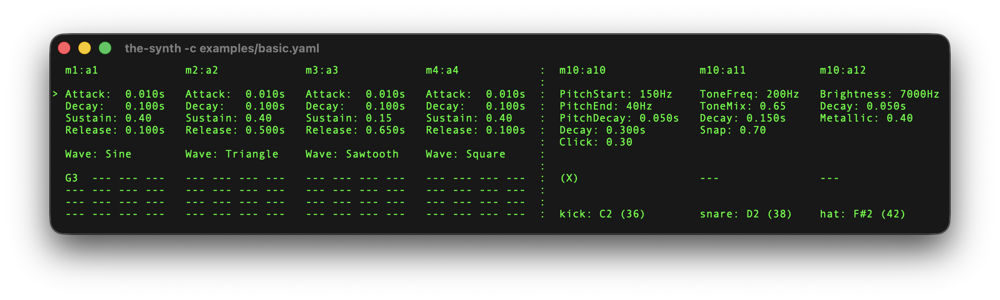
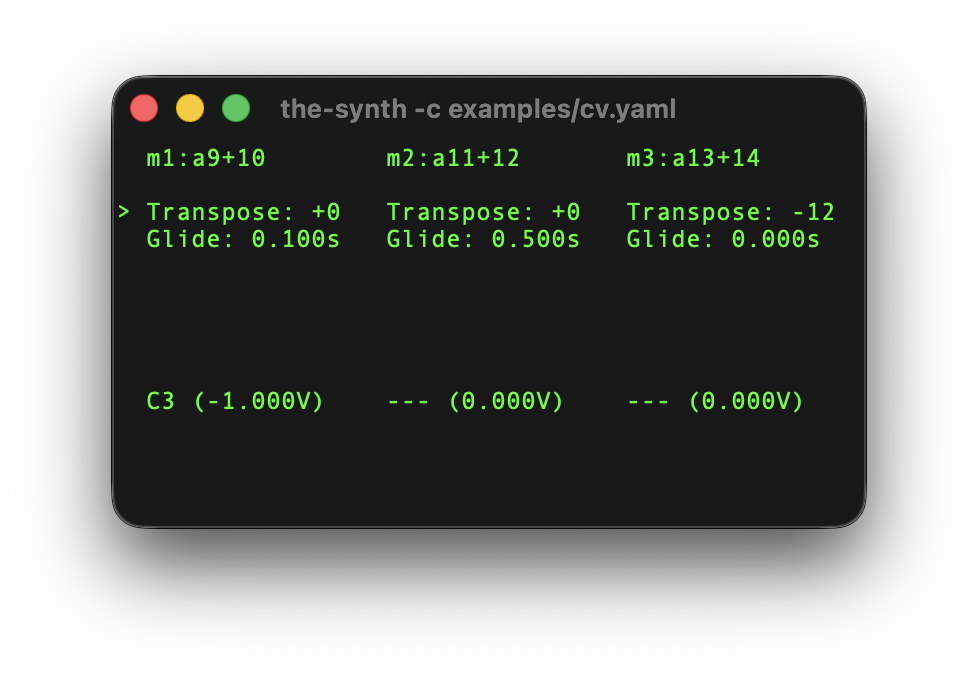

# the-synth

A multi-instance MIDI synthesizer, drum machine, sampler, CV generator, and gate
encoder for the terminal. Run multiple 16-voice polyphonic synthesizers,
physically-modeled drum engines, WAV samplers, control voltage outputs, and ES-5
gate outputs simultaneously, each with independent parameter control and
configurable MIDI/audio channel routing.

## Usage

**Installation:** There's no binary distribution so you must compile it. Use
`make build` or `make install`.

```sh
# Command help
the-synth --help

# List available MIDI and audio devices
the-synth --list

# Run with configuration file
the-synth --config examples/basic.yaml

# Run with default config path (expects synth.yaml in current directory)
the-synth
```

## Configuration

Create a YAML configuration file specifying devices and synth instances:

```yaml
devices:
  midiin: "Your MIDI Device"    # Name or index from --list
  audioout: "Your Audio Device" # Name or index from --list

poly16:
  - midich: 1           # MIDI channel 1-16 or "omni"
    audioch: 1          # Audio output channel (1-indexed)
    attack: 0.01
    decay: 0.1
    sustain: 0.4
    release: 0.1
    wave: sine          # sine, triangle, sawtooth, square

  - midich: 2
    audioch: 2
    attack: 0.001
    decay: 0.05
    sustain: 0.7
    release: 0.2
    wave: sawtooth

drums:
  - midich: 10          # MIDI channel for drum triggers
    audioch: 10         # Audio output channel
    type: kick          # kick, snare, or hat
    note: c2            # MIDI note to trigger (e.g., C2 = 36)
    pitchstart: 150.0
    pitchend: 40.0
    pitchdecay: 0.05
    kdecay: 0.3
    click: 0.3

  - midich: 10
    audioch: 11
    type: snare
    note: d2
    tonefreq: 200.0
    tonemix: 0.65
    sdecay: 0.15
    snap: 0.7

  - midich: 10
    audioch: 12
    type: hat
    note: "f#2"
    brightness: 7000.0
    hdecay: 0.05
    metallic: 0.4

sampler:
  - midich: 1               # MIDI channel for sample triggers
    audioch: 5              # Audio output channel (mono)
    file: samples/clap.wav  # WAV path, relative to the config file
    root: c2                # Note that plays the sample at its recorded pitch
    voices: 1               # Polyphony 1-16 (1 = mono retrigger)
    gain: 0.0               # dB level trim (-60 to +24)
    pitch: 0                # Semitone offset (-24 to +24)
    start: 0.0              # Start offset into the sample (0.0-1.0)
    attack: 0.0             # Fade-in seconds
    release: 0.05           # Fade-out seconds

  - midich: 1
    audioch: 6
    file: samples/piano-c3.wav
    root: c3
    range: [c2, c5]         # Melodic: repitched across the span (must surround root)
    voices: 8               # Polyphonic for chords / overlapping tails

cv:
  - midich: 2           # MIDI channel for CV input
    audioch: 5          # Gate CV on channel 5, Pitch CV on channel 6
    voices: 1           # Number of pitch voices (0 = gate only)
    transpose: 0        # Transpose in semitones (-24 to +24)
    glide: 0.1          # Glide time in seconds (0.0 to 2.0)

  - midich: 3
    audioch: 7          # Gate on 7, pitches on 8, 9, 10
    voices: 3           # Polyphonic: 3 pitch CV outputs
    transpose: 12       # One octave up
    glide: 0.5          # Slower glide

  - midich: 4
    audioch: 11         # Gate only on channel 11
    voices: 0           # No pitch output

es5:
  - midich: 10          # MIDI channel for gate triggers
    audioch: 7          # Stereo pair: channels 7 and 8
    outputs:
      - note: c1        # Output 1 triggered by C1
      - note: d1        # Output 2 triggered by D1
      - note: e1        # Output 3 triggered by E1
      - note: f1        # Output 4 triggered by F1
      - note: g1        # Output 5 triggered by G1
      - note: a1        # Output 6 triggered by A1
```

Each poly16 instance has 16-voice polyphony and independent ADSR/waveform
settings. Each drum instance triggers on a specific MIDI note with
physically-modeled synthesis. Each sampler instance plays a WAV file triggered
by a MIDI note, optionally repitched across a note range for melodic playback.
Each CV instance outputs gate CV and a
configurable number of pitch CVs on consecutive audio channels for interfacing
with modular synthesizers via DC-coupled audio interfaces (e.g., Expert Sleepers
ES-9). Each ES-5 instance encodes up to 6 gate outputs into a stereo audio pair
using the Expert Sleepers ES-5 protocol, providing MIDI-to-gate conversion for
modular synthesizers.

## Interface





### Poly16 Parameters

**Attack** (0.001s - 2.0s): Time to reach peak level when a note is pressed

**Decay** (0.001s - 2.0s): Time to fall from peak to sustain level

**Sustain** (0.0 - 1.0): Amplitude level held while note is pressed

**Release** (0.001s - 5.0s): Time to fade to silence after note is released

**Waveform**: Oscillator shape (Sine, Triangle, Sawtooth, Square)

The voice display shows each of the 16 polyphonic voices with its current note
(e.g., "C4", "F#3") or "---" when idle.

### Drum Parameters

Each drum type has unique physically-modeled parameters:

**Kick** - Bass drum with pitch envelope and beater click
- PitchStart (100-300 Hz): Starting frequency of pitch sweep
- PitchEnd (20-100 Hz): Ending frequency of pitch sweep
- PitchDecay (0.01-0.2s): Speed of pitch envelope
- Decay (0.05-1.0s): Amplitude decay time
- Click (0.0-1.0): Amount of beater click transient

**Snare** - Snare drum with tonal/noise mix and stick attack
- ToneFreq (100-400 Hz): Frequency of tonal component
- ToneMix (0.0-1.0): Balance between tone and noise (0=noise, 1=tone)
- Decay (0.05-0.5s): Amplitude decay time
- Snap (0.0-1.0): Amount of stick attack transient and brightness

**Hat** - Hi-hat with resonant metallic character
- Brightness (5000-12000 Hz): Center frequency of resonant filter
- Decay (0.01-0.3s): Amplitude decay time
- Metallic (0.0-1.0): Resonance amount for bell-like ringing

### Sampler Parameters

Sampler instances play a WAV file triggered by MIDI notes — the sample-based
counterpart to drums. WAV files are decoded to mono once at startup and resampled
on playback, so for cleanest results run the audio device at the files' sample
rate (a device rate below the file rate will alias).

**Note mapping**: `root` (required) plays the sample at its recorded pitch. With
an optional `range: [low, high]` — which must surround `root` — notes across the
span are repitched by `note - root` semitones for melodic playback; without a
range, only `root` triggers. Several instances sharing one `audioch` sum into a
"kit" on a single output.

**Voices** (1-16): Polyphony. `1` is monophonic retrigger; higher values allow
overlapping tails and chords, with oldest-voice stealing.

**Gain** (-60 to +24 dB): Per-sample level trim, since WAV files vary in level.

**Pitch** (-24 to +24 semitones): Tuning offset applied on top of root/range.

**Start** (0.0-1.0): Offset into the sample where playback begins.

**Attack / Release** (seconds): Short fades that keep the sample edges click-free.
Playback is one-shot — note-off is ignored and the sample plays through.

The display shows the file name, a trigger/voice activity indicator, and the root
note with its MIDI number (e.g., `c2 (36)`).

### CV Parameters

CV (Control Voltage) instances output gate CV and 1V/octave pitch CVs on consecutive
audio channels for interfacing with modular synthesizers. Requires a DC-coupled audio
interface (e.g., Expert Sleepers ES-9).

**Channel layout**: Gate CV is always on `audioch`. Pitch voice 1 is on `audioch+1`,
voice 2 on `audioch+2`, and so on. With `voices: 0` only gate is output.

**Voices** (0+): Number of polyphonic pitch CV outputs. Voice allocation uses
oldest-voice stealing when all voices are occupied.

**Note**: When set, only the specified MIDI note triggers CV output (e.g.,
`note: "c2"`). All other notes are ignored. Useful for routing a single drum pad
or key to a dedicated CV output.

**Transpose** (-24 to +24 semitones): Pitch offset applied to incoming MIDI notes

**Glide** (0.0-2.0s): Linear portamento time between notes (legato only, per voice)

The display shows the current MIDI note name and its corresponding voltage (C4 = 0V).
Gate CV is 8V when any note is held, 0V otherwise. Glide only applies when playing
legato within a single voice.

### ES-5 Gate Encoder

ES-5 instances encode up to 6 gate outputs into a stereo audio pair for the
[Expert Sleepers ES-5](https://expert-sleepers.co.uk/es5.html) expansion module.
The ES-5 connects to the ES-9 via a ribbon cable and by default receives audio on
channels 7/8.

Each output is mapped to a MIDI note. Note-on sets the gate high (5V), note-off
sets it low (0V). This is useful for sending triggers and gates from a MIDI
sequencer or controller to eurorack modules (envelopes, sequencer resets, clock
inputs, etc.).

**Channel layout**: The ES-5 uses a stereo pair (`audioch` and `audioch+1`).
Outputs 1-3 are encoded as individual bits in the left channel, outputs 4-6 in
the right channel. Each gate is a single bit within the upper byte of a 24-bit
audio sample.

**Outputs** (1-6): Each output entry maps a MIDI note name to one of the 6 gate
outputs. The display shows each output's note and gate state (`+++` = high,
`---` = low). The ES-5 has 8 physical jacks, but only outputs 1-6 are
addressable via the audio encoding. Outputs 7-8 are expansion ports that require
additional hardware (ESX-8GT, ESX-8CV, or ESX-8MD modules) connected to headers
on the back of the ES-5 PCB.

**Hardware setup**: Connect the ES-5 to the ES-9's GT1 header via the included
ribbon cable. In the ES-9 configuration tool, route two USB audio outputs to
"ES-5 L" and "ES-5 R" (they are not routed by default), and save to flash. Use
the corresponding channel numbers for `audioch` in your config.

## Controls

```
h/l, ←/→             = Switch between instances (poly16, drums, samplers, CVs, ES-5s)

j/k, ↑/↓             = Move cursor between parameters

H/L, tab/shift+tab   = Adjust the selected parameter value

0, $                 = Jump to first/last instance

?                    = Toggle help

q, ctrl+c            = Quit
```

All parameters are editable in real-time during playback. Use Tab to navigate between
instrument instances, and the cursor will maintain its position when switching between
similar parameter sets.
